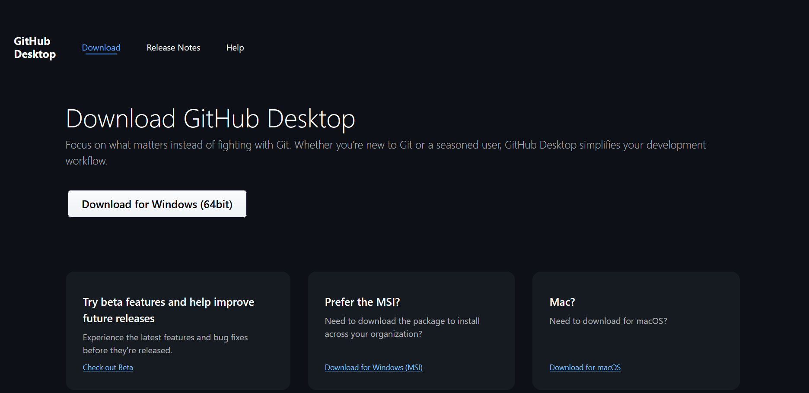
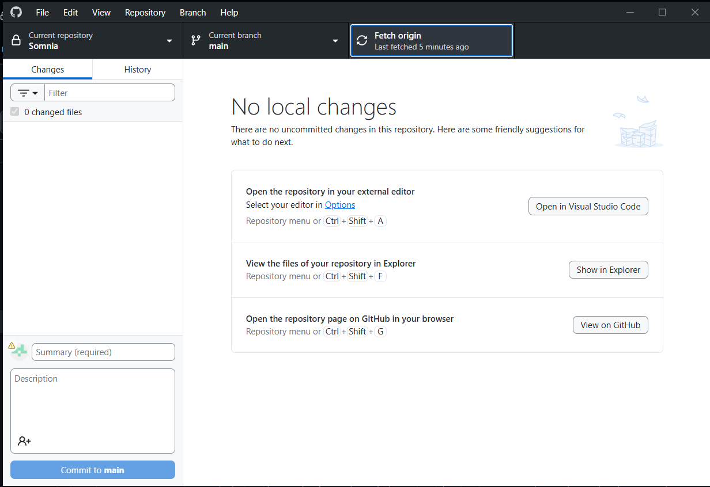
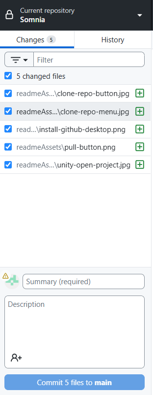
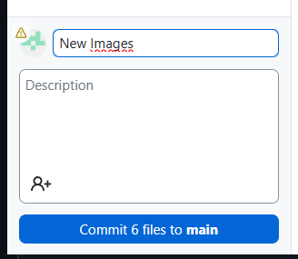

# Somnia

Bienvenido a Somnia, nuestro proyecto de videojuego.

Este repositorio está pensado para trabajar en equipo usando GitHub Desktop, incluso si nunca has usado Git antes.

Este documento te guía paso a paso desde cero:
- Cómo instalar GitHub Desktop
- Cómo descargar el proyecto
- Cómo trabajar correctamente en equipo

---

# Antes de empezar

Regla más importante:

SIEMPRE haz Pull antes de empezar a trabajar  
SIEMPRE haz Push cuando termines  

---

# 1. Instalar herramientas

## Descargar GitHub Desktop

1. Ve a:
https://desktop.github.com/

2. Descarga e instala

3. Inicia sesión con tu cuenta de GitHub

---

## Instalar Unity Hub

https://unity.com/download

Instala la versión correcta del proyecto.

---

# 2. Descargar el proyecto (Clonar)

1. Abre GitHub Desktop  
2. Ve a:
File > Clone repository  

3. Busca el repositorio Somnia  
4. Elige una carpeta en tu computadora  
5. Haz clic en Clone  

---

# 3. Abrir el proyecto en Unity

1. Abre Unity Hub  
2. Haz clic en Add project  
3. Selecciona la carpeta del proyecto  
4. Ábrelo  

---

# 4. Flujo de trabajo

## Antes de trabajar

1. Abre GitHub Desktop  
2. Selecciona Somnia  
3. Haz Fetch origin  
4. Haz Pull origin  

---

## Trabajar

- Abre Unity  
- Realiza tus cambios  

---

## Cuando termines

1. Guarda todo en Unity  
2. Regresa a GitHub Desktop  

---

## Hacer commit

1. Escribe un resumen claro  

Ejemplos:
- Agrega movimiento del jugador  
- Corrige bug en enemigo  
- Mejora iluminación  

2. Haz clic en Commit to main  

---

## Subir cambios

Haz clic en Push origin  

---

# Resumen

Pull → Trabajar → Commit → Push  

---

# Reglas del equipo

1. Siempre hacer Pull antes de trabajar  
2. No trabajar en la misma escena al mismo tiempo  
3. Avisar qué se va a modificar  
4. Usar commits claros  
5. Subir cambios frecuentemente  

---

# Archivos que no se deben subir

No subir:

- Library  
- Temp  
- Logs  
- Obj  

---

# Problemas comunes

## No puedes hacer Push

1. Fetch  
2. Pull  
3. Intenta Push otra vez  

---

## Conflictos

No modificar nada sin entender. Avisar al equipo.

---

## Problemas en Unity

- Verifica que hiciste Pull  
- Verifica la versión de Unity  

---

# Ejemplo

1. Abre GitHub Desktop  
2. Fetch  
3. Pull  
4. Abre Unity  
5. Trabaja  
6. Guarda  
7. Commit  
8. Push  

---

# Regla final

Antes de empezar: Pull  
Al terminar: Commit y Push  

---

# Soporte

Si tienes dudas, pregunta antes de hacer cambios importantes.
